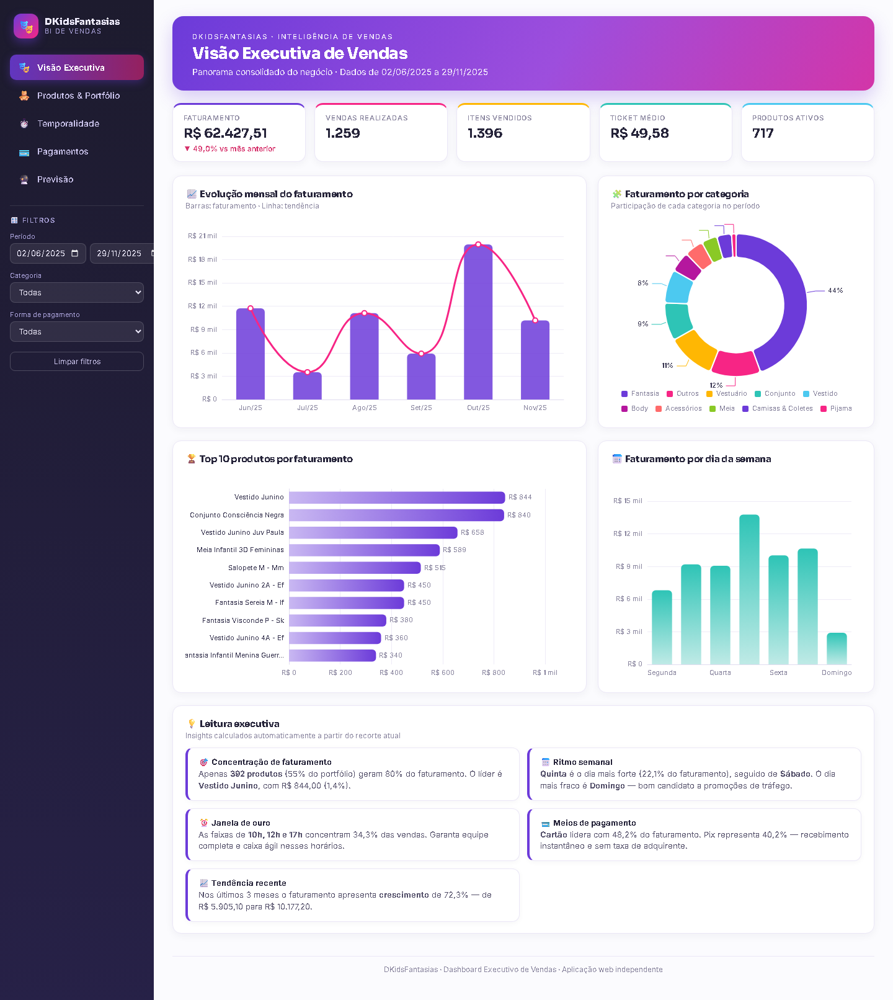
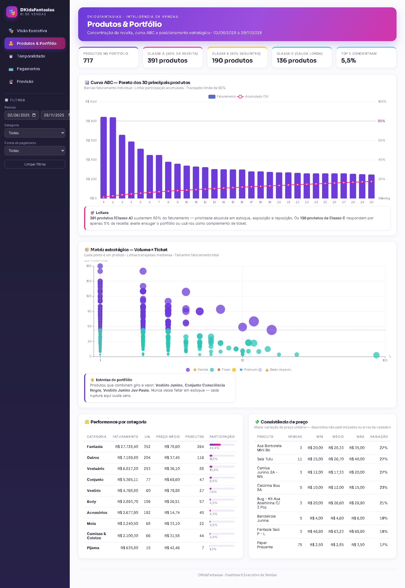
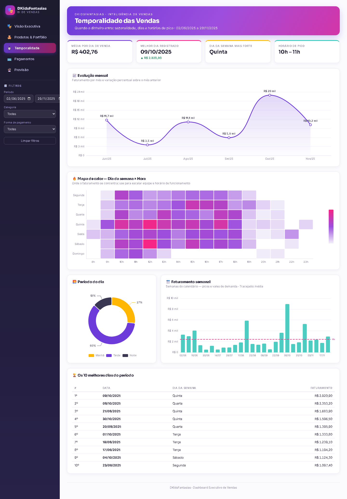
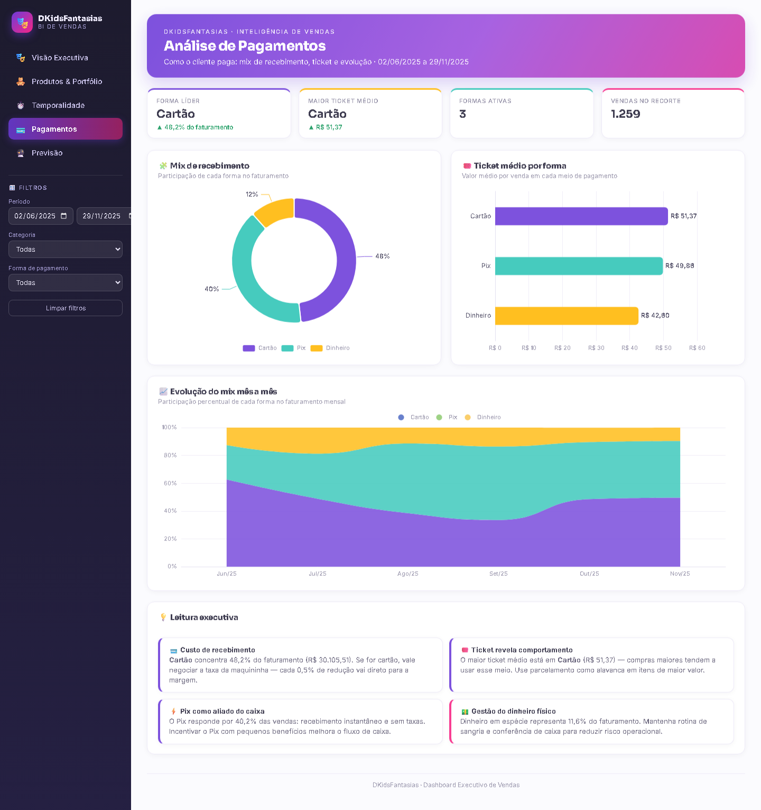
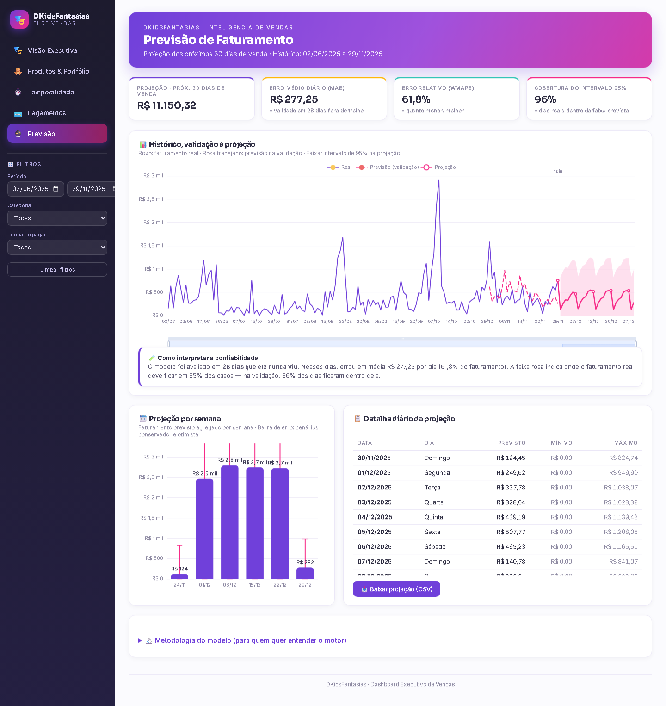

# 🎭 DKids Fantasias — Dashboard de Vendas (BI)


Aplicação web de **Business Intelligence** para a loja **DKidsFantasias** (fantasias e
roupas infantis). Transforma ~1.260 registros de vendas em decisões: concentração de
faturamento, sazonalidade, mix de pagamentos e uma previsão de faturamento validada.

### 👉 [**Acesse o dashboard ao vivo**](https://henry842.github.io/dkidsfantasias-dashboard/) — abre no navegador, sem instalar nada.

---

## 📸 Telas do projeto

### 🎭 Visão Executiva
KPIs do negócio, evolução mensal, mix de categorias, top produtos e insights que o
próprio sistema calcula e escreve a partir dos dados.



### 🧸 Produtos & Portfólio
Curva ABC (Pareto), matriz estratégica Volume × Ticket, performance por categoria e
auditoria de consistência de preço.



### ⏱️ Temporalidade
Sazonalidade mensal e semanal, **mapa de calor dia × hora**, melhores dias e
horários de pico.



### 💳 Pagamentos
Mix de recebimento, ticket médio por forma e evolução da participação mês a mês.



### 🔮 Previsão de Faturamento
Projeção dos próximos 30 dias de venda, com validação honesta (o modelo é testado em
28 dias que ele nunca viu) e faixa de confiança de 95%.



---

## 💡 O que o dashboard entrega (com números reais)

| Indicador | Resultado |
|---|---|
| 💰 Faturamento total | **R$ 62.427,51** |
| 🧾 Vendas realizadas | **1.259** |
| 🎟️ Ticket médio | **R$ 49,58** |
| 📦 Produtos ativos | **717** |
| 🎯 Concentração (curva ABC) | **391 produtos (Classe A) geram 80% da receita** |
| 📅 Dia mais forte | **Quinta-feira** (22,1% do faturamento) |
| ⏰ Horários de pico | **10h, 12h e 17h** (34,3% das vendas) |
| 💳 Pagamento líder | **Cartão** (48,2%) — Pix logo atrás (40,2%) |

Cada número vira uma ação: quais produtos priorizar em estoque, quando reforçar a
equipe, qual taxa de maquininha negociar e quanto faturamento esperar nas próximas semanas.

---

## ✨ Diferenciais técnicos

- **Zero infraestrutura:** BI completo em HTML + JavaScript puro (Apache ECharts). Abre com dois cliques, hospeda de graça ou vai por pendrive — sem servidor, sem Python no cliente.
- **Insights automáticos:** os textos de análise são calculados dos dados e se atualizam com os filtros. Nada é fixo.
- **Filtros globais** (período, categoria, forma de pagamento) recalculam KPIs, gráficos e insights em tempo real.
- **Previsão validada:** o modelo é avaliado em dias que nunca viu (*holdout*) e reporta o próprio erro (MAE / WMAPE) — sem a ilusão de precisão de modelos testados nos dados de treino.
- **Identidade visual própria:** paleta, tipografia e componentes consistentes em todas as telas, com formatação monetária em pt-BR.

---

## 🚀 Como executar

**1. Mais rápido — online:** abra a [demo ao vivo](https://henry842.github.io/dkidsfantasias-dashboard/).

**2. Localmente (aplicação web):**
```bash
# a partir da raiz do repositório
python -m http.server 8765
# depois acesse http://localhost:8765/webapp/
```
Ou simplesmente abra `webapp/index.html` no navegador e arraste o arquivo
`data/vendas_tratadas.csv` para a tela na primeira vez.

**3. Versão legada (Streamlit):**
```bash
pip install -r requirements.txt
streamlit run app.py
```

---

## 🔮 Como funciona a previsão

- **Modelo:** sazonalidade semanal (média ponderada do mesmo dia da semana nas últimas 4 ocorrências) combinada com um fator de tendência amortecido (últimos 14 dias vs 14 anteriores).
- **Validação honesta:** os últimos **28 dias de venda** são separados antes do treino; o erro reportado (MAE, WMAPE, cobertura) vem **só** desses dias que o modelo nunca viu.
- **Intervalo de 95%:** derivado do desvio-padrão dos erros na validação.
- **Projeção:** dia a dia, realimentando o histórico; dias em que a loja não vende são excluídos automaticamente.
- A versão Streamlit usa um regressor **XGBoost** com a mesma disciplina de validação.

---

## ⚠️ Limitações (transparência)

Nenhum projeto de dados é perfeito — estas são as limitações conhecidas deste:

- **Erro da previsão é alto (WMAPE ~62%).** O faturamento diário da loja é muito volátil (de ~R$ 0 a mais de R$ 3.000 num único dia), então o erro relativo por dia é naturalmente grande. A previsão é **confiável no agregado (semana/mês)** e serve para planejamento de estoque e caixa — **não** como valor exato de um dia específico.
- **Sem análise por cliente.** A coluna de cliente está quase toda como "Não informado", então métricas de fidelização/RFM não foram feitas — seriam enganosas com essa qualidade de dado.
- **Histórico curto (~6 meses).** Não há dados suficientes para comparação ano-a-ano nem para capturar toda a sazonalidade anual (Carnaval, festa junina, Halloween, Natal) com robustez estatística.
- **Categorias parcialmente inferidas.** Produtos sem categoria cadastrada são classificados por regras sobre o nome — uma aproximação, não um cadastro oficial.
- **Eventos inéditos não são previstos.** Promoções novas, feriados atípicos ou mudanças de horário fogem ao que o modelo aprendeu no histórico.
- **Dados públicos no GitHub Pages.** A demo ao vivo expõe os números reais de venda. Para uso restrito, torne o repositório privado (GitHub Pro) ou hospede com controle de acesso.

---

## 🗂️ Estrutura do repositório

```
├── webapp/                 # ⭐ Versão atual — app web BI (HTML/CSS/JS + ECharts)
│   ├── index.html          #    Estrutura das 5 telas
│   ├── css/style.css       #    Identidade visual
│   ├── js/engine.js        #    Parse do CSV, agregações, insights e previsão
│   ├── js/app.js           #    Interface: filtros, gráficos, tabelas, navegação
│   └── README.md           #    Documentação técnica da aplicação web
├── docs/                   # Espelho de publicação (GitHub Pages serve daqui)
├── sync_docs.sh            # Sincroniza webapp/ + data/ para docs/
├── data/vendas_tratadas.csv# Base de vendas tratada
├── limpeza.ipynb           # Limpeza e exploração dos dados (Jupyter)
├── export.py               # Pipeline: gera o CSV tratado a partir do bruto
├── app.py, views/, core/   # Versão legada em Streamlit (mantida como referência)
└── assets/screenshots/     # Imagens usadas neste README
```

---

## 🛠️ Stack

**App web (atual):** HTML5 · CSS3 · JavaScript (ES2020) · [Apache ECharts](https://echarts.apache.org/)
**Análise & versão legada:** Python · Pandas · NumPy · Scikit-learn · XGBoost · Streamlit

---

## 👤 Autor

**Henry** — projeto de análise de dados e BI.
