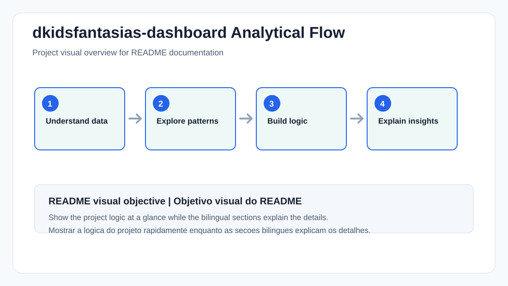

# DKids Fantasias Dashboard

### 🚀 [Ver o dashboard ao vivo | View live dashboard](https://henry842.github.io/dkidsfantasias-dashboard/)

---

## Tech Stack | Tecnologias Utilizadas

**EN**
- Jupyter Notebook — data cleaning and exploration
- Python, Pandas, NumPy — data processing
- Scikit-learn, XGBoost — forecasting model
- Streamlit — internal analytics dashboard (legacy version)
- JavaScript, HTML5, CSS3, Apache ECharts — standalone web BI dashboard (current version)

**PT-BR**
- Jupyter Notebook — limpeza e exploração dos dados
- Python, Pandas, NumPy — processamento de dados
- Scikit-learn, XGBoost — modelo de previsão
- Streamlit — dashboard analítico interno (versão legada)
- JavaScript, HTML5, CSS3, Apache ECharts — dashboard web BI standalone (versão atual)

---

## Executive Summary | Resumo Executivo

**EN**

Business intelligence dashboard built for **DKidsFantasias**, a children's costume
and clothing store. It turns ~1,260 sales records into a decision-making tool:
revenue concentration, seasonality, payment mix and a validated revenue forecast.
Originally built in Streamlit, it was rebuilt as a **standalone web application**
(no server, no install) so the client can open it in any browser or host it for free.

Main objective: give a small retail business the kind of sales intelligence
usually reserved for companies with a data team — with an honest forecast that
reports its own error instead of hiding it.

**PT-BR**

Dashboard de inteligência de negócio construído para a **DKidsFantasias**, uma loja
de fantasias e roupas infantis. Transforma ~1.260 registros de vendas em uma
ferramenta de decisão: concentração de faturamento, sazonalidade, mix de
pagamentos e uma previsão de faturamento validada estatisticamente. Originalmente
feito em Streamlit, foi reconstruído como uma **aplicação web standalone**
(sem servidor, sem instalação) para o cliente abrir em qualquer navegador ou
hospedar de graça.

Objetivo principal: dar a um pequeno negócio de varejo o tipo de inteligência de
vendas normalmente reservado a empresas com time de dados — com uma previsão
honesta, que reporta o próprio erro em vez de escondê-lo.

---

## Project Workflow | Fluxo do Projeto

**EN**
- Clean and standardize raw point-of-sale exports (`limpeza.ipynb`, `padroniza_csv.py`).
- Engineer features: payment method grouping, time-of-day buckets, holidays, ABC class.
- Explore patterns: revenue concentration, weekly/hourly seasonality, price consistency.
- Train a forecasting model and validate it on a holdout period it never saw.
- Ship the result as an interactive dashboard, not a static report.

**PT-BR**
- Limpar e padronizar as exportações brutas do ponto de venda (`limpeza.ipynb`, `padroniza_csv.py`).
- Construir variáveis: agrupamento de pagamento, faixas de horário, feriados, classe ABC.
- Explorar padrões: concentração de faturamento, sazonalidade semanal/horária, consistência de preço.
- Treinar um modelo de previsão e validá-lo num período que ele nunca viu.
- Entregar o resultado como um dashboard interativo, não um relatório estático.

---

## Data Storytelling | Narrativa dos Dados

### Chapter 1 — Data Understanding | Entendimento dos Dados

**EN**

~1,260 sale items between 06/2025 and 11/2025: product, quantity, unit price,
payment method, timestamp and customer (mostly unrecorded, so no per-customer
analysis was attempted — it would be misleading with this data quality).

**PT-BR**

~1.260 itens vendidos entre 06/2025 e 11/2025: produto, quantidade, preço
unitário, forma de pagamento, data/hora e cliente (majoritariamente não
informado, por isso nenhuma análise por cliente foi feita — seria enganosa
com essa qualidade de dado).

### Chapter 2 — Exploratory Analysis | Análise Exploratória

**EN**

Total revenue: **R$ 62,427.51**, across 1,259 sales and 717 active products.
Revenue is highly concentrated: **392 products (~55% of the catalog) generate
80% of revenue** (ABC curve), led by *Vestido Junino* (R$ 844.00). Thursday
is the strongest weekday (22.1% of revenue); Sunday the weakest. Sales peak at
**10h, 12h and 17h** (34.3% of revenue). Card leads payment methods (48.2%),
with Pix close behind (40.2%) — instant settlement, no acquirer fee.

**PT-BR**

Faturamento total: **R$ 62.427,51**, em 1.259 vendas e 717 produtos ativos.
O faturamento é bastante concentrado: **392 produtos (~55% do catálogo) geram
80% da receita** (curva ABC), liderados por *Vestido Junino* (R$ 844,00).
Quinta-feira é o dia mais forte (22,1% do faturamento); domingo o mais fraco.
As vendas concentram picos em **10h, 12h e 17h** (34,3% do faturamento).
Cartão lidera os pagamentos (48,2%), com Pix logo atrás (40,2%) — recebimento
instantâneo, sem taxa de adquirente.

### Chapter 3 — Modeling | Modelagem

**EN**

Revenue forecast uses weekly seasonality (weighted average of the same weekday
over the last 4 occurrences) combined with a damped trend factor. It is
validated on the **last 28 days of sales, held out from training** — the
reported error (MAE, WMAPE) comes exclusively from days the model never saw,
avoiding the common mistake of evaluating a model on its own training data.
The legacy Streamlit version uses an XGBoost regressor instead, with the same
holdout discipline.

**PT-BR**

A previsão de faturamento usa sazonalidade semanal (média ponderada do mesmo
dia da semana nas últimas 4 ocorrências) combinada com um fator de tendência
amortecido. É validada nos **últimos 28 dias de venda, retidos do treino** — o
erro reportado (MAE, WMAPE) vem exclusivamente de dias que o modelo nunca viu,
evitando o erro comum de avaliar um modelo nos próprios dados de treino. A
versão legada em Streamlit usa um regressor XGBoost, com a mesma disciplina
de validação em holdout.

### Chapter 4 — Results and Interpretation | Resultados e Interpretação

**EN**

The dashboard translates every number above into an action: which products
deserve inventory priority (ABC class A), which weekdays/hours need full
staffing, which payment method to negotiate fees on, and how much revenue to
expect in the next 30 sales days — with a 95% confidence band, not a false
single number.

**PT-BR**

O dashboard traduz cada número acima em uma ação: quais produtos merecem
prioridade de estoque (classe A da curva ABC), quais dias/horários exigem
equipe completa, qual forma de pagamento vale negociar taxa, e quanto
faturamento esperar nos próximos 30 dias de venda — com uma faixa de
confiança de 95%, não um número único e falso.

---

## Repository Structure | Estrutura do Repositório

**EN**
- `webapp/`: **current version** — standalone web BI dashboard (HTML/CSS/JS + ECharts). [See webapp/README.md](webapp/README.md).
- `docs/`: GitHub Pages deployment mirror of `webapp/` (this is what the live demo serves).
- `sync_docs.sh`: syncs `webapp/` + `data/` into `docs/` before each deploy.
- `data/vendas_tratadas.csv`: cleaned sales dataset.
- `limpeza.ipynb`, `padroniza_csv.py`, `export.py`: data cleaning and feature pipeline.
- `app.py`, `views/`, `core/`: legacy Streamlit version (kept for reference).
- `assets/readme/`: visuals used in this README.

**PT-BR**
- `webapp/`: **versão atual** — dashboard web BI standalone (HTML/CSS/JS + ECharts). [Veja webapp/README.md](webapp/README.md).
- `docs/`: espelho de publicação do GitHub Pages (`webapp/`) — é o que a demo ao vivo serve.
- `sync_docs.sh`: sincroniza `webapp/` + `data/` para `docs/` antes de cada deploy.
- `data/vendas_tratadas.csv`: base de vendas tratada.
- `limpeza.ipynb`, `padroniza_csv.py`, `export.py`: pipeline de limpeza e engenharia de variáveis.
- `app.py`, `views/`, `core/`: versão legada em Streamlit (mantida como referência).
- `assets/readme/`: visuais usados neste README.

---

## How to Run | Como Executar

**EN**
1. **Fastest:** open the [live demo](https://henry842.github.io/dkidsfantasias-dashboard/) — no install needed.
2. **Locally:** clone the repository, then open `webapp/index.html` in your browser (or run `python -m http.server 8765` from the repo root and visit `http://localhost:8765/webapp/`).
3. **Legacy Streamlit version:** `pip install -r requirements.txt` then `streamlit run app.py`.

**PT-BR**
1. **Mais rápido:** abra a [demo ao vivo](https://henry842.github.io/dkidsfantasias-dashboard/) — sem instalar nada.
2. **Localmente:** clone o repositório e abra `webapp/index.html` no navegador (ou rode `python -m http.server 8765` na raiz do repositório e acesse `http://localhost:8765/webapp/`).
3. **Versão legada em Streamlit:** `pip install -r requirements.txt` e depois `streamlit run app.py`.

---

## Key Takeaways | Principais Aprendizados

**EN**
- A dashboard is more useful than a static report when the client will come back to it every week.
- Forecasts must report their own error — a number without a confidence interval is a guess dressed as a fact.
- Not every dataset supports every analysis: per-customer metrics were dropped here because the data didn't support them honestly.

**PT-BR**
- Um dashboard é mais útil que um relatório estático quando o cliente volta a consultá-lo toda semana.
- Previsões precisam reportar o próprio erro — um número sem intervalo de confiança é um chute disfarçado de fato.
- Nem toda base sustenta toda análise: métricas por cliente foram descartadas aqui porque os dados não as sustentavam com honestidade.

---

## Future Improvements | Próximos Passos

- Track customer identity at checkout to enable RFM/retention analysis.
- Add year-over-year comparison once a second year of data exists.
- Automate `sync_docs.sh` via a CI step on push, instead of running it manually.

---

## Author | Autor

Henry
